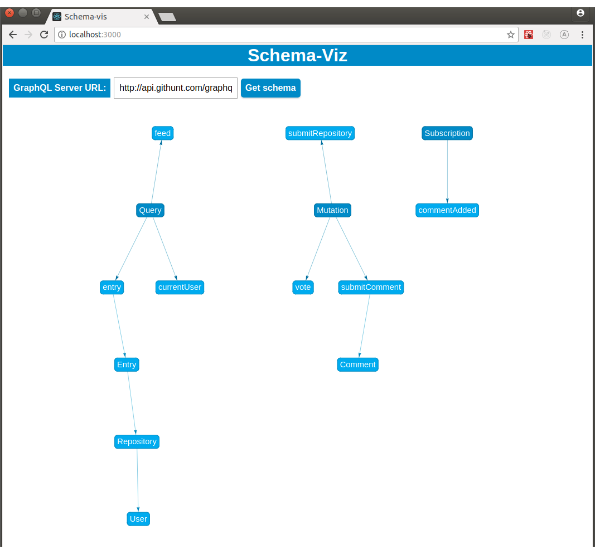

### How is working
It reads GraphQL Schema from an URL
```javascript
  readSchema = uri => {
    const link = new HttpLink({ uri });
    this.setState({ loading: true });
    introspectSchema(link)
      .then(schema => this.setState({ schema, loading: false }))
      .catch(err => {
        console.error(err);
        this.setState({ loading: false, err });
      });
  };
```
Then schema is traversed DFS 
```javascript
function traverseType(type, acumulator, parent) {
  if (!isObjectType(type) || acumulator.hasNode(type.name)) return;

  // add new node to graph
  acumulator.addNode(type.name);
  // add edge
  if (parent != null) acumulator.addEdge(parent, type.name);

  const fields = type.getFields();

  Object.keys(fields).forEach(field =>
    traverseType(fields[field].type, acumulator, type.name)
  );
}
```
and converted to [visjs](http://visjs.org/) graph format
```json
{
  "nodes": [
    {
      "id": "Query",
      "label": "Query",
    },
    {
      "id": "feed",
      "label": "feed",
    }
  ],
  "edges": [
    {
      "from": "Query",
      "to": "feed"
    }
  ]
}
```
and displayed in a graph
```javascript
    <SchemaLoader uri={uri}>
        {(schema, loading, err) => {
            if (err) return `Error: ${err}`;
            if (loading) return 'Loading...';
            const graph = convertSchema(schema);
            return <SchemaGraph graph={graph} />;
        }}
    </SchemaLoader>
```
